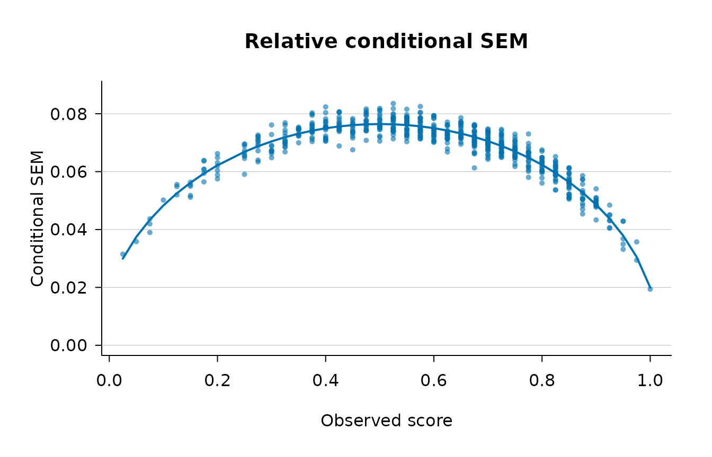

# Introduction to csemGT

## Overview

`csemGT` estimates *conditional* standard errors of measurement (CSEMs)
under Generalizability Theory for the univariate single-facet design in
which persons are crossed with items (a `p $\times$ i` design). Whereas
a single overall SEM summarises measurement precision for a whole test,
a conditional SEM describes how precision varies *along the score
scale*, so that examinees at different observed-score levels can be
assigned different error bands.

The package implements the absolute-error estimator and the three
relative-error estimators (`full`, `large_a`, `uncorrelated`) developed
by Brennan (1998), together with optional polynomial smoothing of the
conditional error variances across the score scale and analytical or
bootstrap standard errors for the per-person estimates. `csemGT` is the
R companion to the Stata `gtcsem` command and reproduces its numerical
results.

This vignette walks through a minimal analysis. For the full argument
list see [`?csem_gt`](https://gempp.cl/csemGT/reference/csem_gt.md); for
replications of published examples see the *Examples* vignette.

## Installation

``` r

# install.packages("remotes")
remotes::install_github("rgempp/csemGT")
```

The `mirt` package is an optional dependency used only by some of the
worked examples in the *Examples* vignette; it is not required for the
core functionality shown here.

## A minimal example

The package ships with `iowa_like`, a simulated `3000 $\times$ 40`
matrix of dichotomously scored item responses. It is **not** real test
data: it was generated from a Rasch model whose parameters were
calibrated so that its ANOVA-based mean error variances match the values
Brennan (1998, p. 314) reports for the ITED Vocabulary Test example. See
[`?iowa_like`](https://gempp.cl/csemGT/reference/iowa_like.md) for the
full provenance.

To keep the vignette fast we draw a reproducible subsample of 600
persons; the analysis is otherwise identical on the full matrix.

``` r

library(csemGT)
data(iowa_like)

set.seed(1998)
iowa_sub <- iowa_like[sample(nrow(iowa_like), 600), ]

fit <- csem_gt(iowa_sub, error_type = "relative", method = "full")
```

`error_type = "relative"` requests the relative ($`\delta`$-type)
conditional error variance, and `method = "full"` selects Brennan’s
finite-sample estimator (Equations 35–36), which is the default. No
bootstrap is requested, so standard errors are the closed-form
analytical approximation.

## Inspecting the fit: `print()`

``` r

fit
#> ----------------------------------------------------------------
#> Conditional SEMs in Generalizability Theory
#> ----------------------------------------------------------------
#> Design          :  univariate single-facet (p x i, crossed)
#> Persons (n_p)   :  600
#> G-study items   :  40
#> D-study items   :  40
#> Method          :  full
#> SE method       :  analytical
#> Smoothing       :  quadratic on observed score
#> ANOVA table
#> ----------------------------------------------------------------
#>   Effect    df              SS              MS         sigma^2
#> ----------------------------------------------------------------
#>   p          599      958.459833        1.600100      0.035236
#>   i           39      359.446500        9.216577      0.015043
#>   pi       23361     4453.553500        0.190641      0.190641
#> D-study error variances and SEMs (n_i' = 40)
#> ----------------------------------------------------------------
#>   sigma^2(Delta) =   0.005142      sigma(Delta) = 0.071708  (absolute)
#>   sigma^2(delta) =   0.004766      sigma(delta) = 0.069036  (relative)
#> Reliability-like coefficients
#> ----------------------------------------------------------------
#>   Generalizability coef.    E rho^2     =   0.8809
#>   Dependability coef.       Phi         =   0.8727
#> Quadratic smoothing fits  (y = b0 + b1*score + b2*score^2)
#> --------------------------------------------------------------------------
#>   Quantity              b0         b1         b2        R^2       RMSE
#> --------------------------------------------------------------------------
#>   rel_ev_full           0.00036    0.02189   -0.02185     0.8843    0.00041
#> Mean variance of estimator across persons
#> ----------------------------------------------------------------
#>   Quantity              Analytical
#> ----------------------------------
#>   rel_ev_full         6.927086e-05
```

The printed report is organised in blocks. The header records the design
and the estimation choices. The ANOVA table gives the person, item, and
residual mean squares and the corresponding variance components. The
D-study block reports the overall absolute and relative error variances
and SEMs: here $`\hat{\sigma}^2(\Delta) \approx .0051`$ and
$`\hat{\sigma}^2(\delta) \approx .0048`$, closely reproducing the values
Brennan (1998) reports for the ITED Vocabulary Test and confirming that
the 600-person subsample preserves the calibrated properties of the full
dataset. The reliability-like coefficients (generalizability coefficient
$`E\rho^2`$ and dependability coefficient $`\Phi`$) and the quadratic
smoothing fit close the report.

## Per-score view: `summary()`

``` r

summary(fit)
#> ----------------------------------------------------------------
#> Summary of Conditional SEMs in Generalizability Theory
#> ----------------------------------------------------------------
#> Paradigm     :  gt
#> Methods      :  full
#> Error types  :  relative
#> Persons      :  600
#> Items        :  40
#> Global statistics
#> ----------------------------------------------------------------
#>   Relative SEM   sigma(delta) = 0.069036     E rho^2 =   0.8809
#>   Absolute SEM   sigma(Delta) = 0.071708     Phi     =   0.8727
#> CSEM by observed score
#> ----------------------------------------------------------------
#>  observed_score group_size cum_freq percentile rel_full
#>           0.025          1   0.0017        0.2  0.03149
#>           0.050          1   0.0033        0.3  0.03583
#>           0.075          3   0.0083        0.8  0.04154
#>           0.100          1   0.0100        1.0  0.05019
#>           0.125          3   0.0150        1.5  0.05413
#>           0.150          5   0.0233        2.3  0.05393
#>           0.175          6   0.0333        3.3  0.06083
#>           0.200          7   0.0450        4.5  0.06183
#>           0.250          9   0.0600        6.0  0.06624
#>           0.275         11   0.0783        7.8  0.06930
#>           0.300         10   0.0950        9.5  0.06864
#>           0.325         14   0.1183       11.8  0.07128
#>           0.350         12   0.1383       13.8  0.07367
#>           0.375         17   0.1667       16.7  0.07514
#>           0.400         19   0.1983       19.8  0.07507
#>           0.425         18   0.2283       22.8  0.07627
#>           0.450         14   0.2517       25.2  0.07443
#>           0.475         19   0.2833       28.3  0.07709
#>           0.500         21   0.3183       31.8  0.07655
#>           0.525         25   0.3600       36.0  0.07675
#>           0.550         30   0.4100       41.0  0.07612
#>           0.575         27   0.4550       45.5  0.07559
#>           0.600         21   0.4900       49.0  0.07443
#>           0.625         20   0.5233       52.3  0.07267
#>           0.650         24   0.5633       56.3  0.07383
#>           0.675         32   0.6167       61.7  0.07136
#>           0.700         37   0.6783       67.8  0.07019
#>           0.725         31   0.7300       73.0  0.06916
#>           0.750         27   0.7750       77.5  0.06728
#>           0.775         21   0.8100       81.0  0.06498
#>           0.800         21   0.8450       84.5  0.06222
#>           0.825         24   0.8850       88.5  0.05991
#>           0.850         25   0.9267       92.7  0.05581
#>           0.875         15   0.9517       95.2  0.05198
#>           0.900         14   0.9750       97.5  0.04919
#>           0.925          7   0.9867       98.7  0.04368
#>           0.950          5   0.9950       99.5  0.03813
#>           0.975          2   0.9983       99.8  0.03257
#>           1.000          1   1.0000      100.0  0.01939
```

[`summary()`](https://rdrr.io/r/base/summary.html) adds the conditional
SEM tabulated by observed score, together with each score group’s size,
cumulative frequency, and percentile. Reading down the `rel_full` column
shows the characteristic concave pattern: the relative CSEM is small at
the extremes of the score scale, rises to a maximum near the middle, and
declines again — the same shape Brennan (1998, Figure 1d) obtained for
the fitted relative SEM of a dichotomously scored test.

## Visualising: `plot()`

``` r

plot(fit)
```



The default plot shows the per-person relative conditional SEM against
observed score, overlaid with the fitted quadratic smooth. Additional
layouts — comparing estimators in a single panel, side-by-side panels,
and analytical or bootstrap confidence bands — are documented in
[`?plot.csem`](https://gempp.cl/csemGT/reference/plot.csem.md) and
demonstrated in the *Examples* vignette.

## The fitted object

[`csem_gt()`](https://gempp.cl/csemGT/reference/csem_gt.md) returns an
object of class `"csem"`. Its main components are the per-person
estimates (`$estimates`), the by-score table (`$by_score`), the G-study
variance components (`$variance_components`), the smoothing fits
(`$smooth_fits`), and the smoother sample diagnostics (`$diagnostics`).
Convenience accessors are provided:

``` r

str(fit, max.level = 1)
#> List of 15
#>  $ estimates          :'data.frame': 600 obs. of  13 variables:
#>  $ by_score           :'data.frame': 39 obs. of  10 variables:
#>  $ call               : language csem_gt(data = iowa_sub, method = "full", error_type = "relative")
#>  $ paradigm           : chr "gt"
#>  $ methods            : chr "full"
#>  $ error_types        : chr "relative"
#>  $ arguments          :List of 17
#>  $ variance_components:List of 6
#>  $ smooth_fits        :List of 1
#>  $ diagnostics        :List of 3
#>  $ bootstrap          : NULL
#>  $ scale_transform    : NULL
#>  $ n_persons          : int 600
#>  $ n_items            : int 40
#>  $ version            :Classes 'package_version', 'numeric_version'  hidden list of 1
#>  - attr(*, "class")= chr [1:2] "csem" "list"

# variance components
coef(fit)
#> $anova_table
#>        source    df        SS        MS
#> 1      person   599  958.4598 1.6000999
#> 2        item    39  359.4465 9.2165769
#> 3 person:item 23361 4453.5535 0.1906405
#> 
#> $person
#> [1] 0.03523648
#> 
#> $item
#> [1] 0.01504323
#> 
#> $residual
#> [1] 0.1906405
#> 
#> $population_quantities
#> $population_quantities$absolute_error_var
#> [1] 0.005142094
#> 
#> $population_quantities$absolute_sem
#> [1] 0.0717084
#> 
#> $population_quantities$relative_error_var
#> [1] 0.004766013
#> 
#> $population_quantities$relative_sem
#> [1] 0.06903632
#> 
#> 
#> $reliability_coefficients
#> $reliability_coefficients$erho2
#> [1] 0.8808571
#> 
#> $reliability_coefficients$phi
#> [1] 0.8726529
#> 
#> $reliability_coefficients$phi_lambda
#> [1] NA

# by-score table as a data frame
head(by_score(fit))
#>   observed_score group_size     cov_xim csem_var.relative_full
#> 1          0.025          1 0.000232906           0.0009915028
#> 2          0.050          1 0.006277778           0.0012836831
#> 3          0.075          3 0.008618946           0.0017291995
#> 4          0.100          1 0.003452991           0.0025185403
#> 5          0.125          3 0.005138889           0.0029325584
#> 6          0.150          5 0.014850427           0.0029124661
#>   csem.relative_full csem_var.analytic.relative_full se.analytic.relative_full
#> 1         0.03148814                    0.0002956770                0.01719526
#> 2         0.03582852                    0.0002283776                0.01511217
#> 3         0.04153760                    0.0001710728                0.01306453
#> 4         0.05018506                    0.0001164025                0.01078900
#> 5         0.05413089                    0.0001003035                0.01001091
#> 6         0.05392755                    0.0001012605                0.01005525
#>   ci_low.analytic.relative_full ci_up.analytic.relative_full
#> 1                   0.000000000                   0.06519023
#> 2                   0.006209218                   0.06544783
#> 3                   0.015931588                   0.06714361
#> 4                   0.029039007                   0.07133111
#> 5                   0.034509874                   0.07375191
#> 6                   0.034219631                   0.07363548
#>   smoothed_csem.relative_full
#> 1                  0.02994060
#> 2                  0.03745157
#> 3                  0.04337611
#> 4                  0.04830156
#> 5                  0.05250982
#> 6                  0.05616233
```

## Next steps

- [`?csem_gt`](https://gempp.cl/csemGT/reference/csem_gt.md) documents
  every argument, including bootstrap options, polynomial smoothing,
  extreme-score handling, and the `n_items_D` D-study generalisation.
- The *Examples* vignette replicates published analyses, including a
  multi-panel comparison of the relative-error estimators.
- The Stata `gtcsem` command produces the same estimates for users
  working in that environment.

## References

Brennan, R. L. (1998). Raw-score conditional standard errors of
measurement in generalizability theory. *Applied Psychological
Measurement, 22*(4), 307–331.
